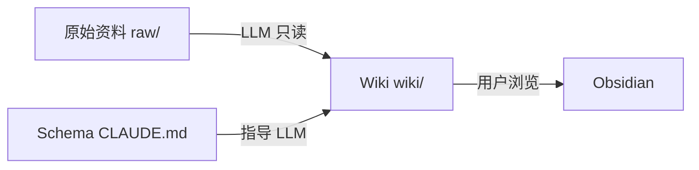
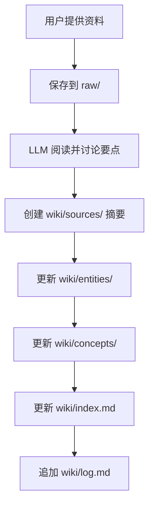
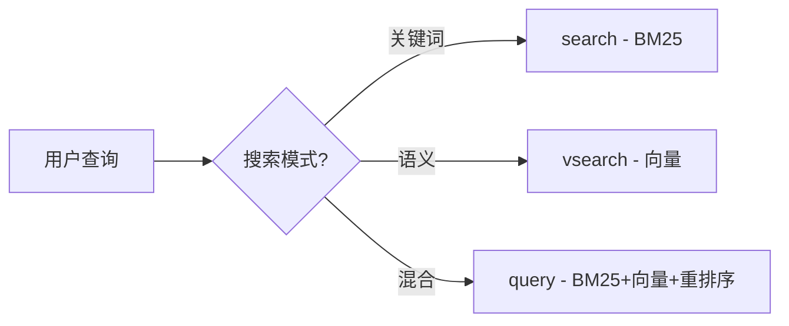

# LLM Wiki 使用手册

本手册帮助你在 Claude Code 中正确使用 LLM Wiki——一个由 LLM 增量构建和维护的个人知识库系统。

---

## 什么是 LLM Wiki

LLM Wiki 是 Andrej Karpathy 提出的一种**个人知识管理模式**。与传统的 RAG（检索增强生成）不同，LLM Wiki 不是每次查询都从原始文档中重新检索和推导，而是让 LLM **持续维护一个结构化的 Wiki 知识库**——每次添加新资料时，LLM 会自动：

- 提取关键信息并创建摘要页
- 更新相关的实体和概念页面
- 建立交叉引用（双链）
- 记录操作日志
- 维护内容索引

**核心理念**：知识是**编译一次、持续更新**的持久资产，而非每次查询时重新推导。

---

## 三层架构



| 层级 | 目录 | 你做什么 | LLM 做什么 |
|------|------|---------|-----------|
| **原始资料** | `raw/` | 投放源文档 | 只读，提取信息 |
| **Wiki** | `wiki/` | 浏览和提问 | 创建、更新、维护所有页面 |
| **Schema** | `CLAUDE.md` | 调整规则 | 遵守规则操作 |

---

## 目录结构说明

```
personal-knowledge/
├── CLAUDE.md              # Schema：告诉 LLM 如何维护 Wiki
├── .gitignore             # Git 忽略规则
│
├── raw/                   # 原始资料层（不可变）
│   ├── articles/          #   Web 文章（Markdown 格式）
│   ├── papers/            #   学术论文（PDF）
│   ├── notes/             #   个人笔记
│   └── assets/            #   图片和附件
│
└── wiki/                  # Wiki 层（LLM 维护）
    ├── index.md           #   内容目录（分类索引）
    ├── log.md             #   操作日志（时间线）
    ├── entities/          #   实体页面（人物、组织、项目等）
    ├── concepts/          #   概念页面（技术概念、理论等）
    ├── sources/           #   来源摘要（每条资料的摘要页）
    └── synthesis/         #   综合页面（对比分析、综述等）
```

---

## 环境搭建

本章节介绍从零搭建 LLM Wiki 环境的完整步骤。

### 前置要求

| 工具 | 版本要求 | 用途 |
|------|---------|------|
| Node.js | >= 22 | 运行 qmd 搜索引擎 |
| Git | 任意 | 版本管理 |
| Claude Code | 最新版 | LLM Agent，维护 Wiki |
| Obsidian | 最新版 | 浏览 Wiki（可选但强烈推荐） |

### 搭建步骤

#### 获取项目

```bash
# 如果项目已在 Git 远程仓库
git clone <仓库地址> personal-knowledge
cd personal-knowledge

# 如果是全新项目
mkdir personal-knowledge && cd personal-knowledge
git init
```

#### 安装 qmd 搜索引擎

qmd 是本地 Markdown 混合搜索引擎，支持 BM25 + 向量语义 + LLM 重排序。

```bash
# 全局安装
npm install -g @tobilu/qmd

# 验证安装
qmd --version
```

**Windows 用户注意**：qmd 的启动脚本 `bin/qmd` 是 shell 脚本，Windows 下不直接兼容。需要手动创建启动器：

```cmd
:: 创建 D:\nvm-nodejs\qmd-node.cmd（路径取决于你的 Node.js 全局目录）
@echo off
node "D:\nvm-nodejs\node_modules\@tobilu\qmd\dist\cli\qmd.js" %*
```

之后用 `qmd-node` 代替 `qmd` 即可。

#### 配置 qmd 集合

```bash
# 为 wiki 目录创建搜索集合
qmd-node collection add "<项目绝对路径>/wiki" --name wiki

# 添加上下文描述（提升搜索质量）
qmd-node context add qmd://wiki "LLM Wiki 个人知识库"

# 生成向量嵌入（首次需下载约 300MB 模型）
qmd-node embed
```

嵌入模型下载可能较慢（从 HuggingFace），可设置镜像加速：

```bash
# Linux/macOS
export HF_MIRROR=https://hf-mirror.com

# Windows PowerShell
$env:HF_MIRROR = "https://hf-mirror.com"

# 然后重新运行
qmd-node embed
```

#### 配置 MCP 服务器

将 qmd 注册为 Claude Code 的 MCP 服务器，使 Claude Code 可以直接调用搜索功能。

在项目目录创建 `.claude/settings.json`：

```json
{
  "mcpServers": {
    "qmd": {
      "command": "node",
      "args": [
        "D:/nvm-nodejs/node_modules/@tobilu/qmd/dist/cli/qmd.js",
        "mcp"
      ]
    }
  }
}
```

> **注意**：路径需替换为你实际的 Node.js 全局安装路径。Windows 用户必须使用 `node` 命令直接调用 `qmd.js`，而非 `qmd` shell 脚本。

#### 配置 Obsidian（可选）

1. 打开 Obsidian → 以文件夹打开仓库 → 选择 `personal-knowledge/`
2. 设置 → 文件与链接 → 附件文件夹路径设为 `raw/assets/`
3. 安装推荐插件：
   - **Obsidian Web Clipper**：浏览器剪藏扩展
   - **Dataview**：基于 frontmatter 运行查询

#### 验证环境

```bash
# 验证 qmd
qmd-node --version          # 应输出 qmd 2.x.x
qmd-node status             # 应显示 wiki 集合信息

# 验证 Git
git log --oneline -1        # 应显示初始提交

# 验证 MCP（在 Claude Code 中）
# 重启 Claude Code 后，qmd MCP 工具会自动加载
```

### 首次使用后的常规操作

```bash
# 添加新资料到 wiki 后，更新搜索索引
qmd-node update             # 重新扫描文件变更
qmd-node embed              # 生成新文件的向量嵌入

# 一行搞定
qmd-node update && qmd-node embed
```

---

## 快速开始

### 初始化

本项目已经完成初始化。如果你在新的环境中使用，只需确保 Claude Code 打开此项目目录即可。`CLAUDE.md` 会自动加载，LLM 将按照其中定义的规则操作 Wiki。

### 添加第一条资料（Ingest）

在 Claude Code 中直接对话：

```
请帮我摄入这篇文章：[粘贴文章内容或提供文件路径]
```

或者直接把文件放入 `raw/` 对应目录后告诉 Claude Code：

```
raw/articles/ 里新加了一篇文章，请处理它
```

LLM 会自动完成：
1. 阅读资料并与你讨论要点
2. 在 `wiki/sources/` 创建来源摘要
3. 在 `wiki/entities/` 和 `wiki/concepts/` 创建或更新相关页面
4. 更新 `wiki/index.md` 索引
5. 在 `wiki/log.md` 追加操作记录

### 提问（Query）

直接向 Claude Code 提问：

```
Wiki 里有哪些关于 Transformer 架构的内容？
```

```
对比一下 RAG 和 LLM Wiki 模式的优劣
```

LLM 会：
1. 先读取 `wiki/index.md` 找到相关页面
2. 深入阅读相关 Wiki 页面
3. 基于已整合的 Wiki 内容回答（而非重新分析原始资料）
4. 如果回答产生了有价值的洞察，会自动创建综合页面存入 `wiki/synthesis/`

### 健康检查（Lint）

定期请求 LLM 检查 Wiki 状态：

```
请做一次 Wiki lint 检查
```

LLM 会检查：
- 页面间的矛盾或过时信息
- 没有入链的孤立页面
- 被提及但缺少独立页面的重要概念
- 缺失的交叉引用
- 可以通过搜索填补的知识空缺

---

## 三大核心操作详解

### Ingest（摄入）

Ingest 是最常用的操作。每次添加新资料时，LLM 会执行完整的摄入流程：



**最佳实践**：
- 逐条摄入并参与讨论，比批量摄入效果更好
- 阅读 LLM 生成的摘要，引导它关注你关心的重点
- 一条资料可能影响 10-15 个 Wiki 页面，这是正常的

### Query（查询）

查询时 LLM 优先从 Wiki（已整合的知识）回答，而非从原始资料重新推导：


**关键洞察**：好的问答结果应该被存入 Wiki。你的一次探索性提问可能产生有价值的对比分析或新发现——这些不应消失在对话历史中。

### Lint（检查）

定期检查保持 Wiki 健康：

```
请执行一次 Wiki lint，检查：
1. 孤立页面
2. 矛盾信息
3. 缺失的概念页面
4. 过时引用
5. 建议搜索的新资料
```

---

## 推荐工具

### Obsidian（强烈推荐）

用 Obsidian 打开本项目目录，即可获得：
- **双链导航**：点击 `[[wikilink]]` 在页面间跳转
- **图谱视图**：可视化 Wiki 中页面之间的关联
- **搜索**：快速查找 Wiki 内容
- **Dataview 插件**：基于 frontmatter 运行查询，生成动态列表

设置方式：
1. 打开 Obsidian → 以文件夹打开仓库 → 选择 `personal-knowledge/`
2. 设置 → 文件与链接 → 附件文件夹路径设为 `raw/assets/`

### Obsidian Web Clipper

浏览器扩展，将网页文章快速转为 Markdown：
1. 安装 Obsidian Web Clipper 浏览器扩展
2. 浏览网页时一键剪藏为 Markdown
3. 将剪藏的文件保存到 `raw/articles/`
4. 告诉 Claude Code 处理新资料

### 本地图片下载

在 Obsidian 中绑定快捷键下载图片到本地：
1. 设置 → 快捷键 → 搜索「下载」
2. 绑定 `Ctrl+Shift+D` 到「下载当前文件的附件」
3. 剪藏文章后按快捷键，所有图片下载到 `raw/assets/`

---

## 常见使用场景

### 场景一：研究某个技术主题

```
我最近在学习 Transformer 架构，这是几篇相关论文...
```

操作流程：
1. 将论文放入 `raw/papers/`
2. LLM 逐篇摄入，创建概念页（如「注意力机制」「位置编码」）
3. 创建实体页（如「Ashish Vaswani」「Google Brain」）
4. 你可以随时提问，LLM 基于已有 Wiki 回答
5. LLM 自动生成对比和综合分析

### 场景二：读书笔记

```
我在读《设计模式》，刚看完第三章，这是我的笔记...
```

操作流程：
1. 笔记放入 `raw/notes/`
2. LLM 为每个设计模式创建概念页
3. 记录模式之间的关系、适用场景、优缺点
4. 读完全书后，LLM 可以生成综合对比

### 场景三：项目管理

```
这是我们团队的技术方案文档，请摄入到 Wiki
```

操作流程：
1. 文档放入 `raw/notes/`
2. LLM 提取关键决策、架构设计、技术选型
3. 创建实体页（团队成员、系统组件）和概念页（设计决策）
4. 后续可以查询 Wiki 了解项目上下文

---

## 页面模板参考

### 来源摘要页

```markdown
---
title: 文章标题
date: 2026-04-30
type: article
source_url: https://example.com/article
tags: [标签1, 标签2]
related_entities: [[实体1]], [[实体2]]
related_concepts: [[概念1]], [[概念2]]
---

## 核心要点
- 要点1
- 要点2

## 详细摘要
...

## 与现有知识的关联
- 与 [[概念X]] 的关系：...
```

### 概念页

```markdown
---
title: 概念名称
tags: [标签]
sources: [[sources/来源1]], [[sources/来源2]]
---

## 定义
...

## 关键要点
- ...

## 与其他概念的关系
- [[概念A]]：关系说明
```

---

## 日志查询技巧

`wiki/log.md` 使用固定前缀格式，可以用简单命令查询：

```bash
# 查看最近 5 条操作
grep "^## \[" wiki/log.md | tail -5

# 查看所有摄入操作
grep "ingest" wiki/log.md

# 查看某天的操作
grep "2026-04-30" wiki/log.md
```

---

## qmd 搜索引擎

本项目已集成 [qmd](https://github.com/tobi/qmd)（Query Markdown）——一个 100% 本地运行的 Markdown 混合搜索引擎。当 Wiki 增长到一定规模后，`index.md` 手动索引不够用时，qmd 提供专业级的搜索能力。

### 安装状态

- **qmd 版本**：2.1.0
- **执行命令**：`qmd-node`（Windows 兼容启动器，映射到 `node ... qmd.js`）
- **Wiki 集合**：已配置，指向 `wiki/` 目录
- **MCP 服务器**：已配置在 `.claude/settings.json`，Claude Code 可直接使用

### Windows 注意事项

qmd 的 `bin/qmd` 是 shell 脚本，Windows 下不兼容。使用以下替代命令：

```bash
# 方式一：使用 qmd-node 启动器（推荐）
qmd-node <命令>

# 方式二：直接用 node 执行
node "D:/nvm-nodejs/node_modules/@tobilu/qmd/dist/cli/qmd.js" <命令>
```

### 搜索模式



| 命令 | 模式 | 速度 | 质量 | 适用场景 |
|------|------|------|------|---------|
| `qmd-node search "关键词"` | BM25 全文 | 快 | 中 | 精确关键词匹配 |
| `qmd-node vsearch "语义查询"` | 向量语义 | 中 | 高 | 自然语言描述 |
| `qmd-node query "综合查询"` | 混合+重排序 | 慢 | 最佳 | 最重要的查询 |

### 常用命令

```bash
# 关键词搜索
qmd-node search "Transformer"
qmd-node search "注意力机制" -c wiki

# 语义搜索（需要先完成 embed）
qmd-node vsearch "如何实现自注意力机制"

# 混合搜索（最佳质量）
qmd-node query "对比 RAG 和 LLM Wiki 的区别"

# 更新索引（添加新资料后运行）
qmd-node update

# 重新生成向量嵌入
qmd-node embed

# 查看索引状态
qmd-node status

# 获取特定文档内容
qmd-node get "concepts/注意力机制.md"
```

### 集合管理

```bash
# 查看所有集合
qmd-node collection list

# 添加新集合（如 raw/ 目录也想要搜索）
qmd-node collection add "E:/code-note/other/personal-knowledge/raw" --name raw

# 添加上下文描述（提升搜索质量）
qmd-node context add qmd://wiki/entities "Wiki 中的实体页面"
qmd-node context add qmd://wiki/concepts "Wiki 中的概念页面"
```

### 多语言支持

默认的 `embeddinggemma-300M` 模型对中文支持有限。如果 Wiki 主要使用中文，建议切换到 Qwen3 Embedding：

```bash
# 设置中文 embedding 模型
export QMD_EMBED_MODEL="hf:Qwen/Qwen3-Embedding-0.6B-GGUF/Qwen3-Embedding-0.6B-Q8_0.gguf"

# 重新生成所有嵌入
qmd-node embed -f
```

### 首次嵌入下载

首次运行 `qmd-node embed` 时会自动下载 GGUF 模型到 `~/.cache/qmd/models/`：

| 模型 | 用途 | 大小 |
|------|------|------|
| embeddinggemma-300M | 向量嵌入（默认） | ~300MB |
| qwen3-reranker-0.6b | 重排序 | ~640MB |
| qmd-query-expansion-1.7B | 查询扩展 | ~1.1GB |

在中国网络环境下，HuggingFace 下载可能较慢。可设置镜像加速：

```bash
export HF_MIRROR=https://hf-mirror.com
qmd-node embed
```

### MCP 集成

qmd 已配置为 Claude Code 的 MCP 服务器。Claude Code 可以直接调用以下工具：

| MCP 工具 | 功能 |
|---------|------|
| `query` | 混合搜索（BM25 + 向量 + 重排序） |
| `get` | 按路径或 docid 获取文档 |
| `multi_get` | 批量获取文档 |
| `status` | 查看索引状态 |

MCP 配置位于 `.claude/settings.json`。

---

## 进阶技巧

### Git 版本管理

整个 Wiki 就是 Git 仓库，天然获得：
- 版本历史：查看每次修改
- 回滚能力：恢复误操作
- 协作支持：多人共建 Wiki

### 与其他 Claude Code 项目联动

本 Wiki 可以作为跨项目的知识中枢。在其他项目中通过 Claude Code 访问本 Wiki 的内容。

### 定期 Lint

建议每添加 5-10 条资料后做一次 Lint 检查，保持 Wiki 健康度。

### 迭代 Schema

`CLAUDE.md` 中的规则可以随使用经验迭代优化。如果你发现 LLM 的某些行为不符合预期，可以在 Schema 中添加或修改规则。

---

## 常见问题

**Q：我可以手动编辑 Wiki 页面吗？**
A：可以，但不建议。LLM 维护交叉引用和一致性，手动编辑可能打破这种一致性。如果编辑了，告诉 LLM 做一次 Lint。

**Q：Wiki 太大了怎么办？**
A：当 Wiki 超过约 100 条来源、数百个页面时，`index.md` 可能不够用。此时可以考虑引入搜索工具（如 qmd）来辅助检索。

**Q：可以批量摄入资料吗？**
A：可以，但建议逐条摄入并参与讨论，效果更好。批量摄入适合你不关心细节、只需要索引的场景。

**Q：原始资料放不下怎么办？**
A：`raw/` 目录只保存重要资料。对于大型资料（如整本书），可以只保存摘要或关键章节。

**Q：怎么用 Obsidian 打开？**
A：Obsidian → 打开仓库 → 选择 `personal-knowledge/` 文件夹即可。所有 `[[wikilink]]` 双链和图谱视图会自动工作。

---

## 参考资源

- [Karpathy 的 LLM Wiki Gist](https://gist.github.com/karpathy/442a6bf555914893e9891c11519de94f) — 本项目的灵感来源
- [Obsidian](https://obsidian.md/) — 推荐的 Wiki 浏览工具
- [Obsidian Web Clipper](https://obsidian.md/plugins?id=web-clipper) — 浏览器剪藏扩展
