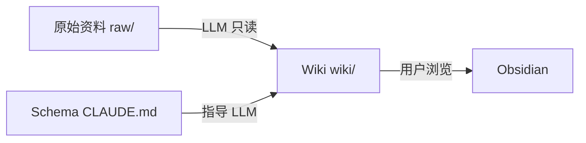
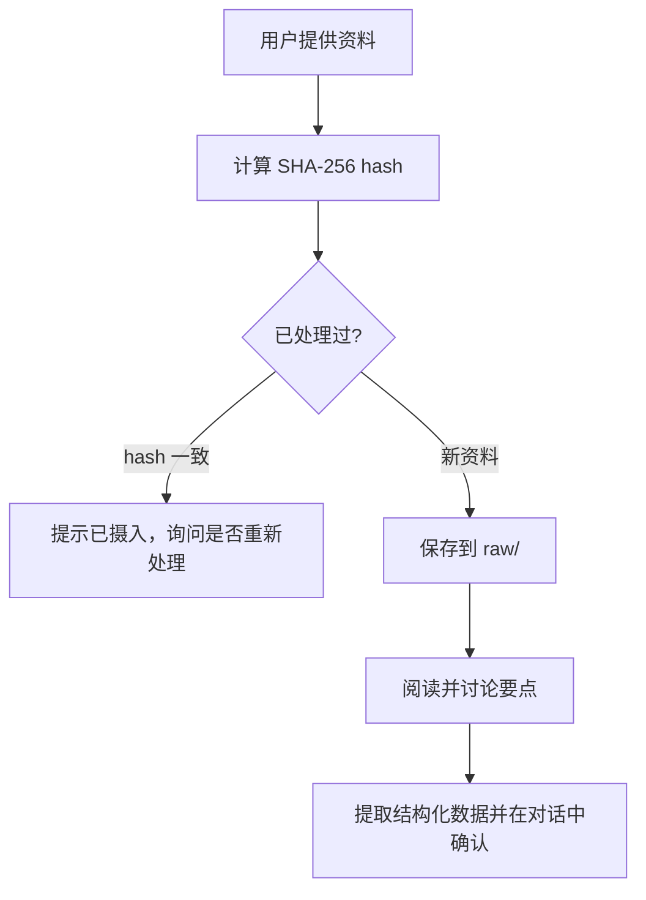
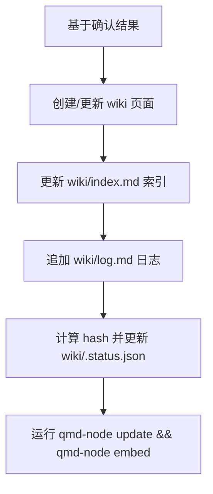
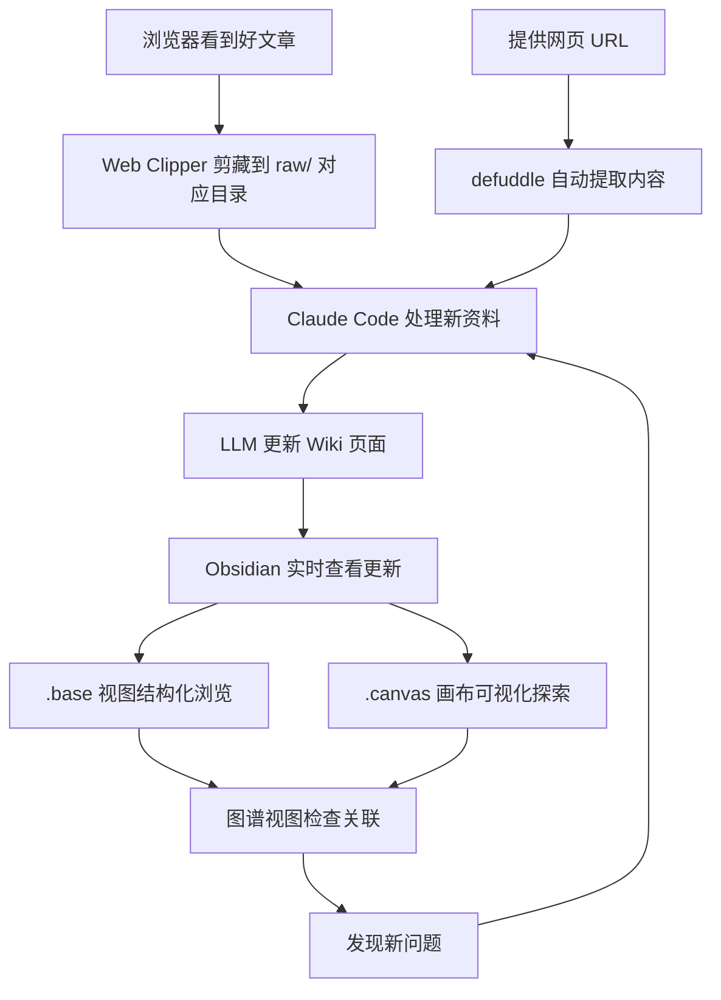
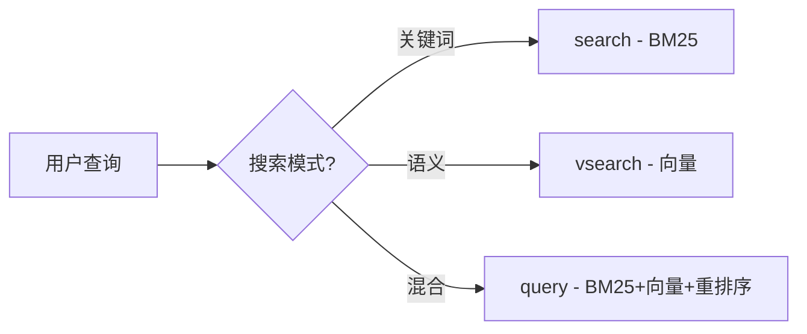

# LLM Wiki 使用手册

本手册帮助你在 Claude Code 中正确使用 LLM Wiki——一个由 LLM 增量构建和维护的个人知识库系统。

---

## 什么是 LLM Wiki

LLM Wiki 是 Andrej Karpathy 提出的一种**个人知识管理模式**。与传统的 RAG（检索增强生成）不同，LLM Wiki 不是每次查询都从原始文档中重新检索和推导，而是让 LLM **持续维护一个结构化的 Wiki 知识库**——每次添加新资料时，LLM 会自动：

- 提取关键信息并创建摘要页
- 更新相关的实体和概念页面
- 建立交叉引用（双链）
- 记录操作日志
- 维护内容索引

**核心理念**：知识是**编译一次、持续更新**的持久资产，而非每次查询时重新推导。

---

## 三层架构



| 层级 | 目录 | 你做什么 | LLM 做什么 |
|------|------|---------|-----------|
| **原始资料** | `raw/` | 投放源文档 | 只读，提取信息 |
| **Wiki** | `wiki/` | 浏览和提问 | 创建、更新、维护所有页面 |
| **Schema** | `CLAUDE.md` | 调整规则 | 遵守规则操作 |

---

## 目录结构说明

```
knowledge-base-lgs/
├── CLAUDE.md              # Schema：告诉 LLM 如何维护 Wiki
├── .gitignore             # Git 忽略规则
│
├── raw/                   # 原始资料层（不可变，按主题组织）
│   ├── attachments/       #   附件（图片、文件等）
│   ├── UOCS开发/          #   UOCS 项目相关资料
│   ├── 数学/              #   数学学习资料
│   ├── 文档书籍翻译/      #   文档和书籍翻译
│   ├── 编程学习/          #   编程学习资料
│   │   ├── java/          #     Java 技术栈（JavaSE、Spring、数据库等）
│   │   ├── 专项研究/      #     深度专题（Ai、Docker、Git、Linux、密码学、设计模式等）
│   │   ├── 前端/          #     前端技术（HTML、CSS、JS、React、Vue）
│   │   ├── 基础知识/      #     计算机基础（操作系统、网络、数据结构等）
│   │   └── 学习路线/      #     学习路径规划
│   └── 英语/              #   英语学习资料
│
└── wiki/                  # Wiki 层（LLM 维护）
    ├── index.md           #   内容目录（分类索引，每次 ingest 后更新）
    ├── log.md             #   操作日志（append-only，记录所有操作）
    ├── .status.json       #   处理状态追踪（hash、已处理文件、页面映射）
    ├── .lint-results.md   #   最近一次 Lint 结果（结构化格式）
    ├── entities/          #   实体页面（人物、组织、项目等）
    ├── concepts/          #   概念页面（技术概念、理论等）
    ├── sources/           #   来源摘要（每条资料的摘要页）
    └── synthesis/         #   综合页面（对比分析、综述等）
```

---

## 环境搭建

本章节介绍从零搭建 LLM Wiki 环境的完整步骤。

### 前置要求

| 工具 | 版本要求 | 用途 |
|------|---------|------|
| Node.js | >= 22 | 运行 qmd 搜索引擎 |
| Git | 任意 | 版本管理 |
| Claude Code | 最新版 | LLM Agent，维护 Wiki |
| Obsidian | 最新版 | 浏览 Wiki（可选但强烈推荐） |

### 搭建步骤

#### 获取项目

```bash
# 如果项目已在 Git 远程仓库
git clone <仓库地址> personal-knowledge
cd personal-knowledge

# 如果是全新项目
mkdir personal-knowledge && cd personal-knowledge
git init
```

#### 安装 qmd 搜索引擎

qmd 是本地 Markdown 混合搜索引擎，支持 BM25 + 向量语义 + LLM 重排序。

```bash
# 全局安装
npm install -g @tobilu/qmd

# 验证安装
qmd --version
```

**Windows 用户注意**：qmd 的启动脚本 `bin/qmd` 是 shell 脚本，Windows 下不直接兼容。需要手动创建启动器：

```cmd
:: 创建 D:\nvm-nodejs\qmd-node.cmd（路径取决于你的 Node.js 全局目录）
@echo off
node "D:\nvm-nodejs\node_modules\@tobilu\qmd\dist\cli\qmd.js" %*
```

之后用 `qmd-node` 代替 `qmd` 即可。

#### 配置 qmd 集合

```bash
# 为 wiki 目录创建搜索集合
qmd-node collection add "<项目绝对路径>/wiki" --name wiki

# 添加上下文描述（提升搜索质量）
qmd-node context add qmd://wiki "LLM Wiki 个人知识库"

# 生成向量嵌入（首次需下载约 300MB 模型）
qmd-node embed
```

嵌入模型下载可能较慢（从 HuggingFace），可设置镜像加速：

```bash
# Linux/macOS
export HF_MIRROR=https://hf-mirror.com

# Windows PowerShell
$env:HF_MIRROR = "https://hf-mirror.com"

# 然后重新运行
qmd-node embed
```

#### 配置 MCP 服务器

将 qmd 注册为 Claude Code 的 MCP 服务器，使 Claude Code 可以直接调用搜索功能。

在项目目录创建 `.claude/settings.json`：

```json
{
  "mcpServers": {
    "qmd": {
      "command": "node",
      "args": [
        "D:/nvm-nodejs/node_modules/@tobilu/qmd/dist/cli/qmd.js",
        "mcp"
      ]
    }
  }
}
```

> **注意**：路径需替换为你实际的 Node.js 全局安装路径。Windows 用户必须使用 `node` 命令直接调用 `qmd.js`，而非 `qmd` shell 脚本。

#### 配置 Obsidian（可选）

1. 打开 Obsidian → 以文件夹打开仓库 → 选择 `personal-knowledge/`
2. 设置 → 文件与链接 → 附件文件夹路径设为 `raw/attachments/`
3. 安装推荐插件：
   - **Obsidian Web Clipper**：浏览器剪藏扩展
   - **Dataview**：基于 frontmatter 运行查询

#### 验证环境

```bash
# 验证 qmd
qmd-node --version          # 应输出 qmd 2.x.x
qmd-node status             # 应显示 wiki 集合信息

# 验证 Git
git log --oneline -1        # 应显示初始提交

# 验证 MCP（在 Claude Code 中）
# 重启 Claude Code 后，qmd MCP 工具会自动加载
```

### 项目 Skills

项目已预配置 5 个 Claude Code Skills，位于 `.claude/skills/` 目录。Claude Code 启动时自动加载，无需手动配置。

| Skill                 | 用途                                | 何时触发                      |
| --------------------- | --------------------------------- | ------------------------- |
| **defuddle**          | 从网页提取干净的 Markdown 内容              | 用户提供 URL 要求摄入网页文章时        |
| **obsidian-cli**      | 通过命令行与运行中的 Obsidian 交互            | 需要在 Obsidian 中创建/搜索/管理笔记时 |
| **obsidian-markdown** | 生成符合 Obsidian 规范的 Markdown 语法     | 创建或编辑 Wiki 页面时            |
| **obsidian-bases**    | 创建 Obsidian Bases 数据库视图（.base 文件） | 需要以表格/卡片形式浏览 Wiki 内容时     |
| **json-canvas**       | 创建 Obsidian Canvas 画布（.canvas 文件） | 需要可视化知识网络或制作思维导图时         |

> **前置依赖**：`obsidian-cli` 和 `obsidian-bases` 需要 Obsidian 处于运行状态。`defuddle` 需要全局安装：`npm install -g defuddle`。

### 首次使用后的常规操作

```bash
# 添加新资料到 wiki 后，更新搜索索引
qmd-node update             # 重新扫描文件变更
qmd-node embed              # 生成新文件的向量嵌入

# 一行搞定
qmd-node update && qmd-node embed
```

---

## 快速开始

### 初始化

本项目已经完成初始化。如果你在新的环境中使用，只需确保 Claude Code 打开此项目目录即可。`CLAUDE.md` 会自动加载，LLM 将按照其中定义的规则操作 Wiki。

### 添加第一条资料（Ingest）

在 Claude Code 中直接对话：

```
请帮我摄入这篇文章：[粘贴文章内容或提供文件路径]
```

或者直接把文件放入 `raw/` 对应目录后告诉 Claude Code：

```
raw/ 里新加了一篇资料，请处理它
```

或者直接提供网页 URL（defuddle skill 会自动提取内容）：

```
请帮我摄入这篇文章：https://example.com/article
```

LLM 会分两个阶段完成摄入：

**阶段一：提取（Extract）**
1. 计算文件 SHA-256 hash，检查是否已处理过（避免重复）
2. 将资料保存到 `raw/` 对应子目录（按主题归类，如编程→`编程学习/`，AI→`编程学习/专项研究/Ai/`）
3. 阅读资料，与用户讨论关键要点
4. 提取结构化数据（来源摘要、实体、概念、待更新页面），在对话中确认

**阶段二：整合（Integrate）**
5. 基于确认结果批量写入文件（来源摘要页、实体页、概念页）
6. 更新 `wiki/index.md` 索引和 `wiki/log.md` 日志
7. 计算所有文件的 hash，更新 `wiki/.status.json`
8. 运行 `qmd-node update && qmd-node embed` 更新搜索索引

### 提问（Query）

直接向 Claude Code 提问：

```
Wiki 里有哪些关于 Transformer 架构的内容？
```

```
对比一下 RAG 和 LLM Wiki 模式的优劣
```

LLM 会：
1. 使用 qmd 混合搜索获取匹配页面和段落（优先 MCP 工具，回退 CLI）
2. 读取每个匹配页面的摘要段落，判断相关性
3. 按聚合排序规则排列（概念页 > 来源摘要页，多命中页面排名提升）
4. 仅对 top 3 页面读取全文
5. 基于 Wiki 内容回答（而非重新分析原始资料），附 `[[wikilink]]` 引用
6. 如果回答产生了有价值的洞察，自动创建综合页面存入 `wiki/synthesis/`

**搜索回退策略**：qmd 结果不足 3 个页面时，回退到读取 `wiki/index.md`；仍不足时提示用户补充资料。

### 健康检查（Lint）

定期请求 LLM 检查 Wiki 状态：

```
请做一次 Wiki lint 检查
```

LLM 会检查（输出为结构化格式，结果写入 `wiki/.lint-results.md`）：

| 类型 | 严重度 | 说明 |
|------|--------|------|
| contradiction | warning | 两个或多个页面存在矛盾 |
| stale | warning | 信息过时或被新资料取代 |
| orphan | info | 没有入链的孤立页面 |
| broken-link | warning | 指向不存在的页面的 wikilink |
| missing-page | info | 被频繁引用但缺少独立页面的概念 |
| missing-summary | warning | 页面缺少摘要段落 |
| suggestion | info | 建议补充的来源或方向 |

Lint 执行流程：对比 `.status.json` 中的 hash 确定变化页面 → 优先检查变化页面 → 扫描所有页面 → 写入 `.lint-results.md` → 追加 `log.md` → 更新 `.status.json`

---

## 三大核心操作详解

### Ingest（摄入）

Ingest 是最常用的操作。每次添加新资料时，LLM 分两个阶段执行：

**阶段一：提取（Extract）**



**阶段二：整合（Integrate）**



**最佳实践**：
- 逐条摄入并参与讨论，比批量摄入效果更好
- 阅读 LLM 生成的摘要，引导它关注你关心的重点
- 一条资料可能影响 10-15 个 Wiki 页面，这是正常的

### Query（查询）

查询时 LLM 优先使用 qmd 搜索 Wiki（已整合的知识），而非从原始资料重新推导：


**搜索回退**：qmd 结果不足 → 回退到 `index.md` → 仍不足则提示用户补充资料。

**关键洞察**：好的问答结果应该被存入 Wiki。你的一次探索性提问可能产生有价值的对比分析或新发现——这些不应消失在对话历史中。

### Lint（检查）

定期检查保持 Wiki 健康。结果以结构化格式写入 `wiki/.lint-results.md`：

```
请执行一次 Wiki lint
```

每个问题使用固定格式：

````
---LINT: 类型 | 严重度 | 简短标题---
问题描述。
PAGES: page1.md, page2.md
---END LINT---
````

LLM 会优先检查 `.status.json` 中 hash 变化的页面，然后扫描全部页面。

---

## Obsidian 详细使用指南

Obsidian 是浏览和管理 LLM Wiki 的最佳工具。本章节从零开始，手把手教你配置和使用。

### 什么是 Obsidian

Obsidian 是一个**本地 Markdown 笔记软件**，它不是云服务，所有文件都存在你的电脑上。它和 LLM Wiki 完美搭配，因为 Wiki 本身就是一组 Markdown 文件——用 Obsidian 打开就能直接浏览、搜索和跳转。

### 下载安装

1. 访问 [obsidian.md](https://obsidian.md/)，点击「Download」
2. 下载 Windows 版安装包
3. 运行安装程序，按提示完成安装
4. 首次启动会看到欢迎页面

### 打开 Wiki 仓库

Obsidian 把文件夹叫做「仓库」（Vault）。我们的 Wiki 就是一个仓库：

1. 启动 Obsidian
2. 在欢迎页面点击「打开文件夹作为仓库」（Open folder as vault）
3. 浏览并选择 `E:\code-note\other\knowledge-base-lgs` 文件夹
4. 点击「选择文件夹」
5. Obsidian 左侧文件树会显示所有 Wiki 文件

> **提示**：打开后你会在左侧看到 `wiki/`、`raw/` 等文件夹，点击展开就能浏览所有 Wiki 页面。

### 必做的基础设置

打开后，点击左下角齿轮图标进入设置，依次配置：

#### 文件与链接

路径：设置 → 文件与链接

| 设置项 | 值 | 为什么 |
|--------|-----|-------|
| 附件文件夹路径 | `raw/attachments` | 剪藏文章和下载图片时，附件自动存到 raw/attachments |
| 内部链接类型 | `与文件名相同` | 保证 `[[wikilink]]` 格式统一 |
| 新建笔记位置 | `仓库根目录` | 可选，不影响 Wiki（LLM 负责创建文件） |

#### 编辑器

路径：设置 → 编辑器

| 设置项 | 值 | 为什么 |
|--------|-----|-------|
| 默认编辑模式 | `实时预览` | 边写边看效果，对新手友好 |
| 显示行号 | 打开 | 方便定位 |
| 可读行宽 | 打开 | 长文章不会撑满屏幕，阅读更舒适 |

#### 外观

路径：设置 → 外观

选择你喜欢的主题（亮色/暗色），也可以在社区主题中安装更多。

### 核心功能使用

#### 双链导航（最关键的功能）

Wiki 中所有页面间的引用使用 `[[双链]]` 语法。在 Obsidian 中：

- **跳转**：按住 `Ctrl` 点击 `[[页面名]]`，直接跳转到目标页面
- **悬停预览**：鼠标悬停在 `[[页面名]]` 上，弹窗显示页面内容摘要
- **创建链接**：在编辑模式输入 `[[`，会弹出已有页面列表，选择即可
- **返回**：按 `Ctrl+Alt+←`（后退）或 `Ctrl+Alt+→`（前进）在页面间导航

**实际体验**：LLM 摄入一篇 Transformer 论文后，你可以在 `wiki/concepts/注意力机制.md` 页面看到 `[[位置编码]]`、`[[自注意力]]` 等双链。点击就能跳到对应概念页，悬停就能预览——就像 Wikipedia 的超链接，但是本地的。

#### 图谱视图（可视化知识网络）

图谱视图展示 Wiki 中所有页面的关联关系：

1. 点击左侧工具栏的「图谱」图标（圆形节点图标）
2. Obsidian 会绘制一张网状图，每个节点代表一个 Wiki 页面
3. 有双链关系的页面之间会显示连线
4. 鼠标悬停高亮关联节点，点击跳转到对应页面
5. 可以拖拽、缩放、筛选

**看图谱的意义**：
- 枢纽节点（连线多的）是核心概念
- 孤立节点（没有连线的）是待补充关联的页面
- 连线密集的区域是知识集中的主题

#### 全局搜索

按 `Ctrl+Shift+F` 打开全局搜索：

- 输入关键词，实时搜索所有 Wiki 页面
- 搜索结果高亮匹配位置
- 支持正则表达式搜索（在搜索框右侧切换）
- 可以按标签、路径等筛选

#### 反向链接面板

每个页面右侧有一个「反向链接」面板：

- 显示**哪些页面链接到了当前页面**
- 这是发现意外关联的好工具
- 例如：你打开「注意力机制」页面，反向链接会列出所有提到注意力机制的页面

### 推荐插件配置

点击 设置 → 第三方插件 → 关闭安全模式 → 浏览社区插件，搜索安装：

#### Obsidian Web Clipper（必装）

**用途**：在浏览器中一键剪藏网页文章为 Markdown，直接存入 `raw/` 对应主题目录。

**安装**：
1. 这不是 Obsidian 插件，而是浏览器扩展
2. 访问 [Chrome Web Store](https://chromewebstore.google.com/detail/obsidian-web-clipper/hoiblzcfboikdgehdiaeaigphlcekmnb) 安装
3. 安装后在浏览器右上角出现 Obsidian 图标

**使用**：
1. 浏览到想保存的网页文章
2. 点击浏览器右上角 Obsidian 图标
3. 选择保存路径为 `raw/` 下合适的主题目录（如 `raw/编程学习/专项研究/Ai/`）
4. 点击「剪藏」
5. 文章以 Markdown 格式保存到 `raw/` 对应目录
6. 告诉 Claude Code：「raw/ 里有新资料，请处理」

#### Dataview（推荐）

**用途**：基于页面的 frontmatter（YAML 头部信息）运行查询，生成动态列表。

**安装**：设置 → 第三方插件 → 浏览 → 搜索「Dataview」→ 安装并启用

**LLM Wiki 中的用法**：LLM 会为每个 Wiki 页面添加 YAML frontmatter，Dataview 可以利用这些元数据。例如在某个笔记页面输入：

````markdown
```dataview
TABLE date AS 日期, type AS 类型
FROM "wiki/sources"
SORT date DESC
```
````

这会自动生成一个表格，列出 `wiki/sources/` 下所有来源摘要的日期和类型。

#### Obsidian Bases（推荐，替代 Dataview 的官方方案）

**用途**：创建数据库视图（.base 文件），以表格、卡片、列表等形式浏览 Wiki 内容。这是 Obsidian 官方功能，比 Dataview 更原生。

**使用方式**：项目已配置 `obsidian-bases` skill，Claude Code 可以直接为你生成 .base 文件。只需告诉 LLM：

```
请为 wiki/sources/ 下的所有来源摘要创建一个表格视图
```

LLM 会生成一个 `.base` 文件，在 Obsidian 中打开即可看到动态表格。

**支持的视图类型**：

| 视图 | 适用场景 |
|------|---------|
| `table` | 结构化数据浏览（来源列表、实体列表） |
| `cards` | 卡片式浏览（概念概览、实体介绍） |
| `list` | 简洁列表（标签汇总、分类索引） |

#### Obsidian CLI（命令行交互）

**用途**：从 Claude Code 直接操控运行中的 Obsidian，无需切换窗口。

**前置条件**：Obsidian 必须处于运行状态，且已启用本地 URI 支持。

**使用方式**：项目已配置 `obsidian-cli` skill。Claude Code 可以：

- 搜索笔记：`obsidian search query="Transformer"`
- 创建笔记：`obsidian create name="新概念" content="内容"`
- 读取笔记：`obsidian read "wiki/concepts/注意力机制.md"`
- 追加内容：`obsidian append "wiki/log.md" content="新日志条目"`
- 打开笔记：`obsidian open "wiki/index.md"`

> **提示**：这些操作由 Claude Code 自动调用，你只需正常对话。但在需要快速操作时，也可以直接告诉 LLM 使用 obsidian-cli。

#### JSON Canvas（知识可视化）

**用途**：创建 Obsidian Canvas 画布文件（.canvas），用于可视化知识网络、制作思维导图、构建设计草图。

**使用方式**：项目已配置 `json-canvas` skill。告诉 LLM：

```
请为 Transformer 相关的概念创建一个知识图谱画布
```

LLM 会生成 `.canvas` 文件，在 Obsidian 中打开即可看到节点和连线组成的可视化图谱。

#### 本地图片下载（可选但推荐）

**用途**：将剪藏文章中的远程图片下载到本地，避免图片链接失效。

**配置**：
1. 在 Obsidian 打开一篇有图片的剪藏文章
2. 按 `Ctrl+P` 打开命令面板
3. 搜索「下载附件」或「Download attachments」
4. 所有远程图片会自动下载到 `raw/attachments/`
5. 文章中的图片链接自动替换为本地路径

**绑定快捷键**：
1. 设置 → 快捷键
2. 搜索「下载」或「download」
3. 找到「下载当前文件的所有附件」
4. 点击右侧 `+` 号，按下 `Ctrl+Shift+D`
5. 之后剪藏文章后按 `Ctrl+Shift+D` 即可一键下载图片

### 日常使用工作流



**推荐的日常工作流程**：

1. **收集**：用 Web Clipper 剪藏文章 → 存到 `raw/` 对应主题目录，或直接提供 URL 给 Claude Code（defuddle 自动提取）
2. **处理**：在 Claude Code 中告诉 LLM 处理新资料 → LLM 自动更新 Wiki
3. **浏览**：在 Obsidian 中打开更新后的 Wiki 页面 → 阅读摘要、点击双链跳转
4. **结构化查看**：让 LLM 创建 .base 视图 → 以表格/卡片形式浏览 Wiki 内容
5. **探索**：用图谱视图查看知识网络，或让 LLM 创建 .canvas 画布 → 发现孤立节点或新关联
6. **提问**：回到 Claude Code 提问 → LLM 基于已有 Wiki 回答 → 有价值的洞察存入 Wiki
7. **循环**：重复以上步骤，知识库越来越丰富

### 小技巧

- **分屏工作**：屏幕左边开 Claude Code，右边开 Obsidian。Claude Code 修改 Wiki 时，Obsidian 会实时反映变更
- **快速打开页面**：在 Obsidian 中按 `Ctrl+O`，输入页面名快速打开
- **标签搜索**：在搜索框输入 `tag:标签名` 搜索带特定标签的页面
- **星标页面**：右键常用页面 → 「星标」，方便快速访问
- **快捷键 `Ctrl+E`**：在编辑模式和预览模式间切换

---

## 常见使用场景

### 场景一：研究某个技术主题

```
我最近在学习 Transformer 架构，这是几篇相关论文...
```

操作流程：
1. 将论文放入 `raw/` 对应主题目录
2. LLM 逐篇摄入，创建概念页（如「注意力机制」「位置编码」）
3. 创建实体页（如「Ashish Vaswani」「Google Brain」）
4. 你可以随时提问，LLM 基于已有 Wiki 回答
5. LLM 自动生成对比和综合分析

### 场景二：读书笔记

```
我在读《设计模式》，刚看完第三章，这是我的笔记...
```

操作流程：
1. 笔记放入 `raw/` 对应主题目录
2. LLM 为每个设计模式创建概念页
3. 记录模式之间的关系、适用场景、优缺点
4. 读完全书后，LLM 可以生成综合对比

### 场景三：项目管理

```
这是我们团队的技术方案文档，请摄入到 Wiki
```

操作流程：
1. 文档放入 `raw/` 对应主题目录
2. LLM 提取关键决策、架构设计、技术选型
3. 创建实体页（团队成员、系统组件）和概念页（设计决策）
4. 后续可以查询 Wiki 了解项目上下文

---

## 页面模板参考

> **重要**：所有 Wiki 页面在 frontmatter 之后、第一个 `##` 标题之前，必须包含一段 **50-100 字的摘要段落**。Query 时 LLM 只读取摘要即可判断相关性，避免消耗过多 Token。

### 来源摘要页

```markdown
---
title: 文章标题
date: 2026-04-30
type: article | paper | note
source_url: https://...
tags: [标签1, 标签2]
related_entities: [[实体1]], [[实体2]]
related_concepts: [[概念1]], [[概念2]]
---

一句话概括本文的核心内容、关键发现或价值所在。

## 核心要点
- 要点1
- 要点2

## 详细摘要
...

## 与现有知识的关联
- 与 [[概念X]] 的关系：...
```

### 实体页面

```markdown
---
title: 实体名称
type: person | organization | project | tool
tags: [标签]
sources: [[sources/来源1]], [[sources/来源2]]
---

一句话描述该实体的身份、核心业务和在当前知识库中的相关性。

## 概述
...

## 关键信息
- ...

## 相关实体与概念
- [[实体Y]]：关系说明
- [[概念Z]]：关系说明
```

### 概念页面

```markdown
---
title: 概念名称
tags: [标签]
sources: [[sources/来源1]], [[sources/来源2]]
---

一句话定义该概念及其在知识体系中的位置。

## 定义
...

## 关键要点
- ...

## 与其他概念的关系
- [[概念A]]：关系说明
```

### 综合页面

```markdown
---
title: 综合标题
type: comparison | review | analysis | discovery
date: 2026-04-30
sources: [[sources/来源1]], [[sources/来源2]]
tags: [标签]
---

一句话说明该综合分析的核心结论或发现。

## 问题/主题
...

## 分析
...

## 结论
...
```

---

## 日志查询技巧

`wiki/log.md` 使用固定前缀格式，可以用简单命令查询：

```bash
# 查看最近 5 条操作
grep "^## \[" wiki/log.md | tail -5

# 查看所有摄入操作
grep "ingest" wiki/log.md

# 查看某天的操作
grep "2026-04-30" wiki/log.md
```

---

## qmd 搜索引擎

本项目已集成 [qmd](https://github.com/tobi/qmd)（Query Markdown）——一个 100% 本地运行的 Markdown 混合搜索引擎。

### 使用优先级

- Wiki 页面超过 **20 个**时，所有 Query 操作**必须优先使用 qmd 搜索**
- 低于 20 个页面时，可直接读取 `index.md` 定位
- 每次 ingest 完成后**必须**运行 `qmd-node update && qmd-node embed` 更新索引

### 安装状态

- **qmd 版本**：2.1.0
- **执行命令**：`qmd-node`（Windows 兼容启动器，映射到 `node ... qmd.js`）
- **Wiki 集合**：已配置，指向 `wiki/` 目录
- **MCP 服务器**：已配置在 `.claude/settings.json`，Claude Code 可直接使用

### Windows 注意事项

qmd 的 `bin/qmd` 是 shell 脚本，Windows 下不兼容。使用以下替代命令：

```bash
# 方式一：使用 qmd-node 启动器（推荐）
qmd-node <命令>

# 方式二：直接用 node 执行
node "D:/nvm-nodejs/node_modules/@tobilu/qmd/dist/cli/qmd.js" <命令>
```

### 搜索模式



| 命令 | 模式 | 速度 | 质量 | 适用场景 |
|------|------|------|------|---------|
| `qmd-node search "关键词"` | BM25 全文 | 快 | 中 | 精确关键词匹配 |
| `qmd-node vsearch "语义查询"` | 向量语义 | 中 | 高 | 自然语言描述 |
| `qmd-node query "综合查询"` | 混合+重排序 | 慢 | 最佳 | 最重要的查询 |

### 常用命令

```bash
# 关键词搜索
qmd-node search "Transformer"
qmd-node search "注意力机制" -c wiki

# 语义搜索（需要先完成 embed）
qmd-node vsearch "如何实现自注意力机制"

# 混合搜索（最佳质量）
qmd-node query "对比 RAG 和 LLM Wiki 的区别"

# 更新索引（添加新资料后运行）
qmd-node update

# 重新生成向量嵌入
qmd-node embed

# 查看索引状态
qmd-node status

# 获取特定文档内容
qmd-node get "concepts/注意力机制.md"
```

### 集合管理

```bash
# 查看所有集合
qmd-node collection list

# 添加新集合（如 raw/ 目录也想要搜索）
qmd-node collection add "E:/code-note/other/knowledge-base-lgs/raw" --name raw

# 添加上下文描述（提升搜索质量）
qmd-node context add qmd://wiki/entities "Wiki 中的实体页面"
qmd-node context add qmd://wiki/concepts "Wiki 中的概念页面"
```

### 多语言支持

默认的 `embeddinggemma-300M` 模型对中文支持有限。如果 Wiki 主要使用中文，建议切换到 Qwen3 Embedding：

```bash
# 设置中文 embedding 模型
export QMD_EMBED_MODEL="hf:Qwen/Qwen3-Embedding-0.6B-GGUF/Qwen3-Embedding-0.6B-Q8_0.gguf"

# 重新生成所有嵌入
qmd-node embed -f
```

### 首次嵌入下载

首次运行 `qmd-node embed` 时会自动下载 GGUF 模型到 `~/.cache/qmd/models/`：

| 模型 | 用途 | 大小 |
|------|------|------|
| embeddinggemma-300M | 向量嵌入（默认） | ~300MB |
| qwen3-reranker-0.6b | 重排序 | ~640MB |
| qmd-query-expansion-1.7B | 查询扩展 | ~1.1GB |

在中国网络环境下，HuggingFace 下载可能较慢。可设置镜像加速：

```bash
export HF_MIRROR=https://hf-mirror.com
qmd-node embed
```

### MCP 集成

qmd 已配置为 Claude Code 的 MCP 服务器。Claude Code 可以直接调用以下工具：

| MCP 工具 | 功能 |
|---------|------|
| `query` | 混合搜索（BM25 + 向量 + 重排序） |
| `get` | 按路径或 docid 获取文档 |
| `multi_get` | 批量获取文档 |
| `status` | 查看索引状态 |

MCP 配置位于 `.claude/settings.json`。

---

## 处理状态与 Hash 追踪

`wiki/.status.json` 记录每条 raw/ 资料的处理状态，用于增量处理和去重。

### 工作原理

```json
{
  "version": 1,
  "processed": {
    "raw/编程学习/专项研究/Ai/某文章.md": {
      "ingested_at": "2026-04-30",
      "raw_hash": "sha256-hash",
      "source_page": "wiki/sources/某文章.md",
      "created_pages": [
        "wiki/concepts/概念1.md",
        "wiki/entities/实体1.md"
      ],
      "page_hashes": {
        "wiki/concepts/概念1.md": "sha256-hash",
        "wiki/entities/实体1.md": "sha256-hash"
      },
      "last_lint_at": null
    }
  }
}
```

### 两个关键 Hash

| Hash | 位置 | 作用 |
|------|------|------|
| `raw_hash` | 每个 processed 条目 | Ingest 前对比，判断资料是否需要重新处理 |
| `page_hashes` | 每个 processed 条目 | Lint 前对比，判断哪些页面被外部修改，优先检查 |

Hash 使用 `sha256sum`（Git Bash 自带）计算，在 Ingest 和 Lint 完成时自动更新。

---

## 进阶技巧

### Git 版本管理

整个 Wiki 就是 Git 仓库，天然获得：
- 版本历史：查看每次修改
- 回滚能力：恢复误操作
- 协作支持：多人共建 Wiki

### 与其他 Claude Code 项目联动

本 Wiki 可以作为跨项目的知识中枢。在其他项目中通过 Claude Code 访问本 Wiki 的内容。

### 定期 Lint

建议每添加 5-10 条资料后做一次 Lint 检查，保持 Wiki 健康度。

### 迭代 Schema

`CLAUDE.md` 中的规则可以随使用经验迭代优化。如果你发现 LLM 的某些行为不符合预期，可以在 Schema 中添加或修改规则。

---

## 常见问题

**Q：我可以手动编辑 Wiki 页面吗？**
A：可以，但不建议。LLM 维护交叉引用和一致性，手动编辑可能打破这种一致性。如果编辑了，告诉 LLM 做一次 Lint。

**Q：Wiki 太大了怎么办？**
A：Wiki 超过 20 个页面时，查询自动切换到 qmd 搜索引擎（BM25 + 向量语义 + LLM 重排序），不再依赖手动索引。定期 Lint 可保持健康度。

**Q：可以批量摄入资料吗？**
A：可以，但建议逐条摄入并参与讨论，效果更好。批量摄入适合你不关心细节、只需要索引的场景。

**Q：原始资料放不下怎么办？**
A：`raw/` 目录只保存重要资料。对于大型资料（如整本书），可以只保存摘要或关键章节。

**Q：怎么用 Obsidian 打开？**
A：Obsidian → 打开仓库 → 选择 `knowledge-base-lgs/` 文件夹即可。所有 `[[wikilink]]` 双链和图谱视图会自动工作。

---

## 参考资源

- [Karpathy 的 LLM Wiki Gist](https://gist.github.com/karpathy/442a6bf555914893e9891c11519de94f) — 本项目的灵感来源
- [Obsidian](https://obsidian.md/) — 推荐的 Wiki 浏览工具
- [Obsidian Web Clipper](https://obsidian.md/plugins?id=web-clipper) — 浏览器剪藏扩展
