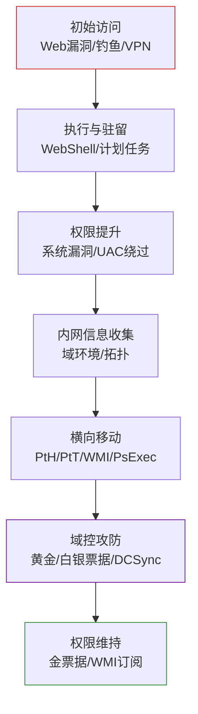

## 定义

内网渗透（Internal Penetration / Lateral Movement）是攻击者在突破企业边界后，在内部网络中进行 **信息收集、权限提升、横向移动、域控攻防、权限维持** 的综合性攻击实践，是高级红队作战的核心环节。

## 标准攻击链

## 关键技术

### 权限提升

- **Windows**：内核漏洞、UAC 绕过、服务配置错误、令牌窃取
- **Linux**：SUID/GTFOBins、内核漏洞、sudo 配置错误、cron 任务

### 横向移动

- **凭证攻击**：Pass-the-Hash（PtH）、Pass-the-Ticket（PtT）
- **远程执行**：WMI、WinRM、PsExec、SMB
- **协议复用**：RDP、SSH 密钥复用、ARP 欺骗

### 域控攻防

- **票据攻击**：黄金票据（Golden Ticket）、白银票据（Silver Ticket）
- **协议攻击**：DCSync、Kerberoasting、AS-REP Roasting、NTLM Relay
- **图形化分析**：BloodHound（Active Directory 关系图谱）

### 权限维持

- **持久化技术**：金票据、骨骼钥匙（Skeleton Key）、SSP 注入、WMI 事件订阅
- **隐蔽通信**：DNS 隧道、HTTPS C2、域前置（Domain Fronting）

## 工具链

| 工具 | 用途 |
|------|------|
| **Cobalt Strike** | 商业级红队 C2 框架 |
| **Metasploit** | 开源渗透框架 |
| **BloodHound** | AD 域关系可视化分析 |
| **CrackMapExec** | 内网横向瑞士军刀 |
| **Impacket** | Python 内网协议库（smbexec/wmiexec/psexec） |
| **Mimikatz** | Windows 凭证提取神器 |
| **Frp / NPS / Chisel** | 内网穿透/隧道 |
| **Proxychains** | 多级代理穿透 |

## 免杀技术

- **Shellcode 处理**：混淆、加密、分离免杀（加载器 + payload 分离）
- **白名单利用**：rundll32、mshta、certutil
- **内存加载**：反射式 DLL 注入
- **混淆器**：Veil、Shellter

## 社会工程学（初始访问辅助）

- 钓鱼邮件、伪造登录页
- Office 宏攻击（Word/Excel + DDE）
- HTA / CHM / LNK 文件钓鱼
- USB 投放（Rubber Ducky）
- SET（Social Engineering Toolkit）

## 与其他概念的关系

- [[concepts/网络安全]]：内网渗透是网络安全的高级专项
- [[concepts/渗透测试]]：内网渗透是渗透测试的进阶阶段（外网突破之后）
- [[concepts/Web安全漏洞]]：Web 漏洞常作为内网渗透的初始入口
