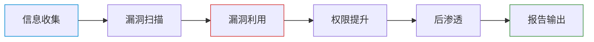

渗透测试是一种授权的模拟攻击，由安全人员扮演攻击者角色，通过系统化方法发现并利用目标系统的漏洞，以评估安全状况并提出修复建议。本页涵盖标准流程（信息收集、漏洞扫描、利用、提权、后渗透）、核心工具链（Burp Suite、Metasploit、Nmap 等）和法律合规要求。

## 定义

渗透测试（Penetration Testing，简称 PenTest）是一种 **授权的模拟攻击**，由安全人员扮演攻击者角色，通过系统化方法发现并利用目标系统的漏洞，以评估其安全状况并提出修复建议。

## 标准流程

## 关键阶段

### 信息收集（侦察）

- **被动收集**（不接触目标）：whois、DNS 枚举、Google Dorks、Shodan、ZoomEye/Fofa、GitHub 泄露
- **主动收集**（需授权）：Nmap 端口扫描、目录扫描（dirsearch/gobuster/ffuf）、指纹识别（Wappalyzer/whatweb）、WAF 识别（wafw00f）

### 漏洞扫描

- **商业扫描器**：Nessus、AWVS（Acunetix）
- **开源工具**：OpenVAS、Nikto、Xray

### 漏洞利用

- **核心框架**：Metasploit（msfconsole）、Cobalt Strike（红队商业级 C2）
- **自动化工具**：SQLMap（SQL 注入）

### 后渗透与持续控制

- **WebShell 管理**：蚁剑、冰蝎、哥斯拉
- **凭证提取**：Mimikatz
- **隧道穿透**：Frp、NPS、Chisel、Proxychains

## 关键术语

| 术语 | 含义 |
|------|------|
| Shell / WebShell | 获取目标命令执行环境 |
| Exploit / Payload | 漏洞利用代码 / 攻击载荷 |
| Bypass | 绕过安全机制 |
| 0day | 未公开漏洞 |
| 提权 | 普通用户 → 管理员 |
| C2 | 命令与控制服务器 |
| APT | 高级持续性威胁 |

## 实战靶场

| 级别 | 靶场 |
|------|------|
| 入门 | DVWA、SQLi-Labs、Pikachu、Upload-Labs |
| 进阶 | Vulhub（真实 CVE 复现）、OWASP Buggy Web App |
| 高级 | Hack The Box、VulnHub、TryHackMe |

## 行业认证

- **OSCP**（首选实战认证，含金量极高）
- **OSWE**（Web 安全专家）
- **OSEP**（高级渗透）

## 与其他概念的关系

- [[concepts/网络安全]]：渗透测试是网络安全攻防的核心实践
- [[concepts/Web安全漏洞]]：渗透测试中最常遇到的漏洞类型
- [[concepts/内网渗透]]：渗透测试在企业内网环境的进阶应用
